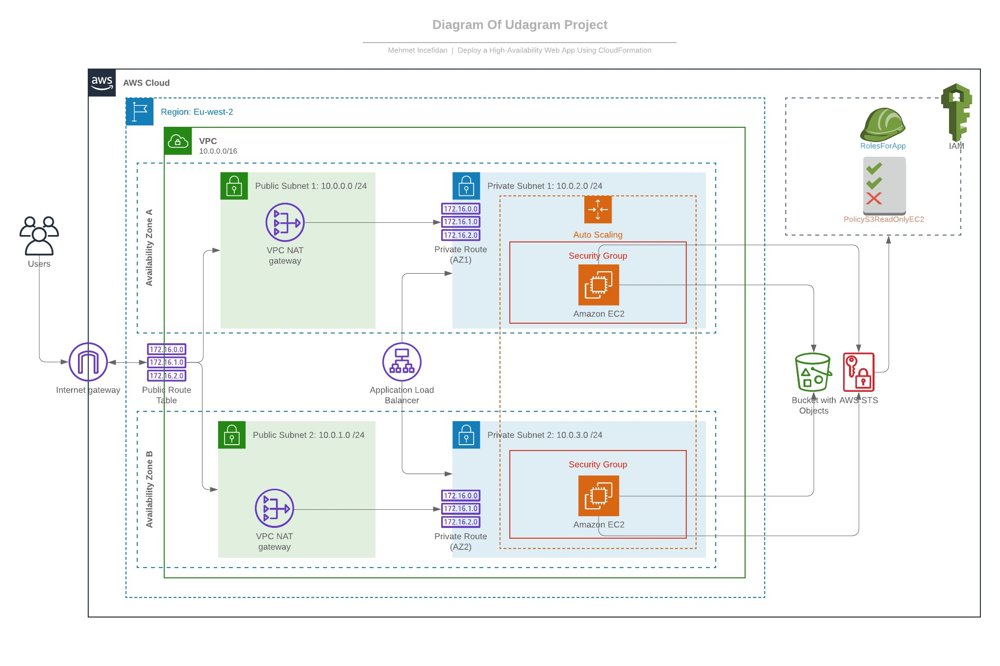

# Project 2 - Deploy a High-Availability Web App using CloudFormation 



> In this project, I deployed web servers for a highly available web app using CloudFormation.
> I wrote the script that creates and deploys the infrastructure and application.
> The script begin deploying the networking components followed by servers, security roles and software.

## Instruction of deploy:

Just run;
change create with update or destroy
```sh
> ./create.sh CloudformationInfra infrastructure_networkandserver.yml infrastructure_networkandserver.json
```

note
-----

if we want to add s3 bucket as in the diagram remove comment from the script
